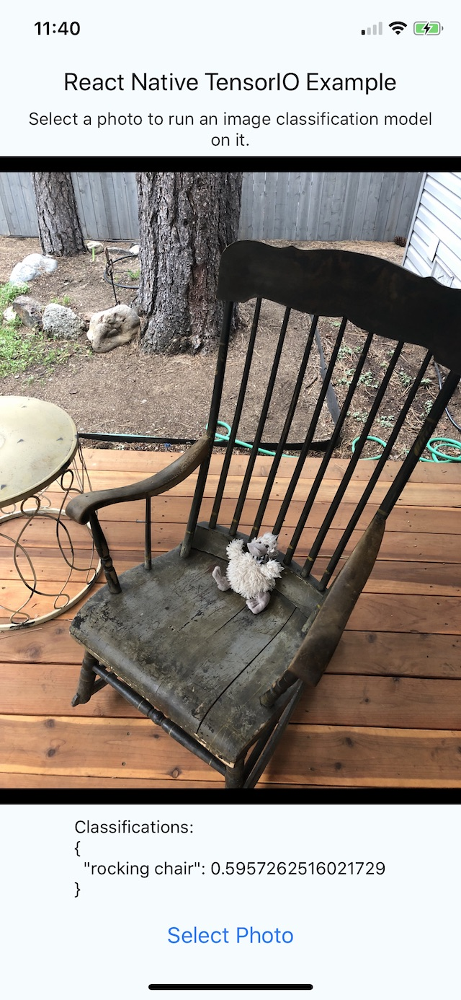

# TensorIOExample

An example application for our [react-native-tensorio](https://github.com/doc-ai/react-native-tensorio) package that shows how to use a computer vision model for TensorFlow Lite and TensorIO inside a React Native application.

<span style="color:red;">**DEPRECATED**</span>

See instead:

https://github.com/doc-ai/react-native-tensorio-tflite

https://github.com/doc-ai/react-native-tensorio-tensorflow

**Learn More**

[Read more about TensorFlow Lite](https://www.tensorflow.org/lite)

[Read more about TensorIO](https://github.com/doc-ai/tensorio-ios)



## Usage

### iOS

In the root directory:

- Install dependencies: `npm install`

In the iOS directory:

- Install CocoaPods: `gem install cocoapods`
- Install Pods: `pod install`
- Launch: `open TensorIOExample.xcworkspace`

### Android

Android support is forthcoming.

## Reproducing this Repo

Initialize the application and install the required packages:

```bash
$ react-native init TensorIOExample
$ npm install react-native-tensorio
$ npm install react-native-image-picker
$ react-native link
```

If react-native link does not successfully link the installed packages, [manually link them](https://facebook.github.io/react-native/docs/linking-libraries-ios).

Install [cocoapods](https://cocoapods.org/) if you do not already have it. Initialize a podfile and add the TensorIO dependency:

```bash
$ cd ios
$ pod init

# add dependencies (see Podfile)

$ pod install
```

From this point on build and run the application from the **TensorIOExample.xcworkspace** project file instead of TensorIOExample.xcodeproj.

Update App.js (see App.js).

Open TensorIOExample.xcworkspace and add the *image-classification.tfbundle* folder to it (see ios/image-classification.tfbundle). This is a TensorFlow Lite image classification model that has been packaged into a TensorIO bundle.

Run the app. If you would like to run the application on a physical device you will probably need to update your code signing identities.

